# Unsupervised Anomaly Detection using Generative Adversarial Network on medical X-Ray image

## Data
- MURA data set https://stanfordmlgroup.github.io/competitions/mura/
- Public, detect abnormality in X-Ray images.

## Model 
- Bidirection GAN / ALI : https://arxiv.org/abs/1605.09782 / https://arxiv.org/abs/1606.00704
- Alpha-GAN (VAE + GAN): https://arxiv.org/abs/1706.04987

## Approach
Leveraging the ability to unsupervisedly learned the structure of data to generate realisitic image, this experiments aims to use that ability to perform binary classification when only trained on one class.

### How:
- Train GAN model with the ability to inference on the latent variable (VAE+GAN / BiGAN) on only 'negative class'
- Let the model learn until it can generate good looking images.
- Use the Encoder, Generator, Discriminator outputs and hidden features to calculate 'Reconstruction loss' and 'Feature matching' loss.
- Classify into 'negative' or 'positive' based on the score above.

## Generative results:
#### Bigan
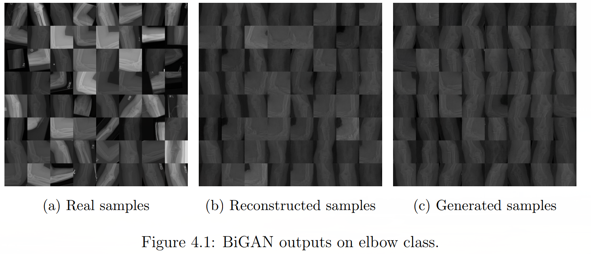

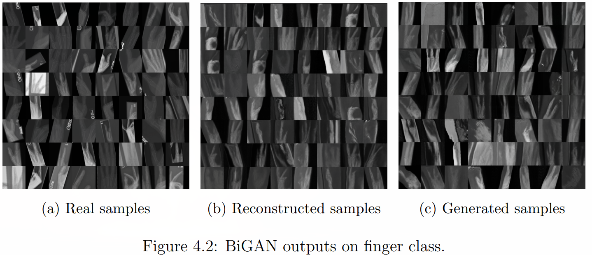

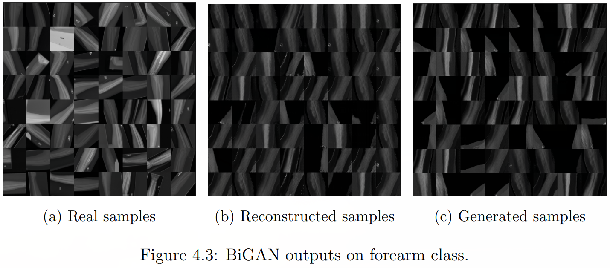

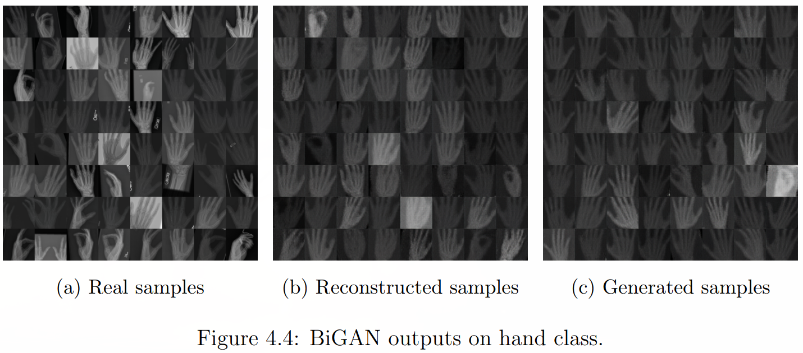

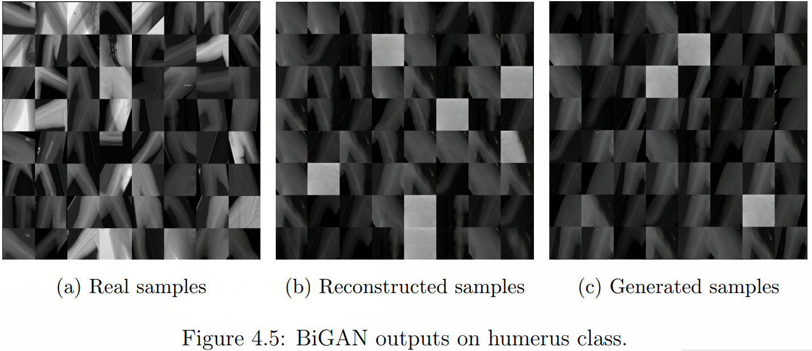

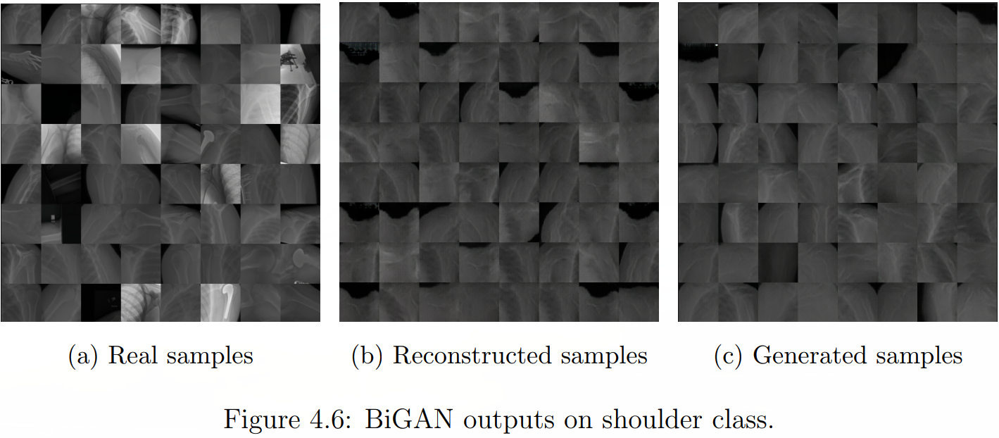

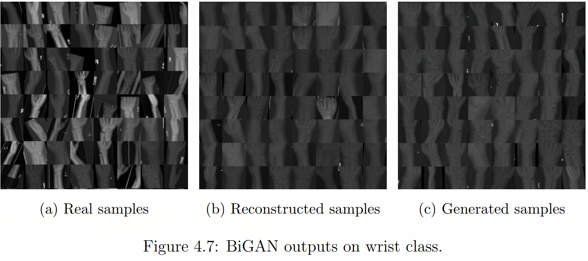

#### Alpha-GAN 
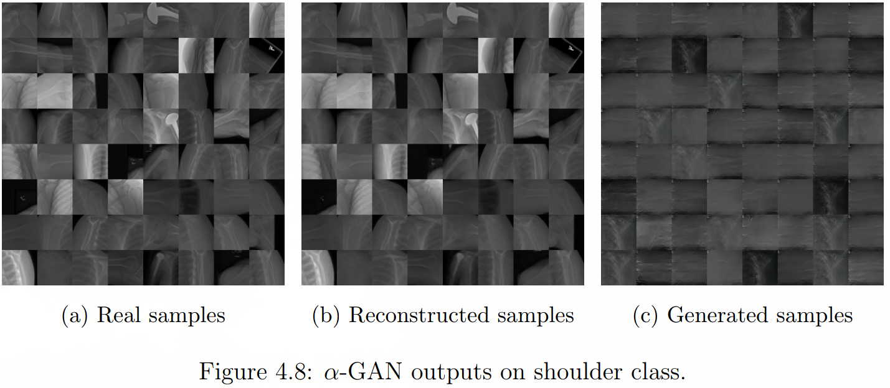

## Discriminative Result
#### Bigan
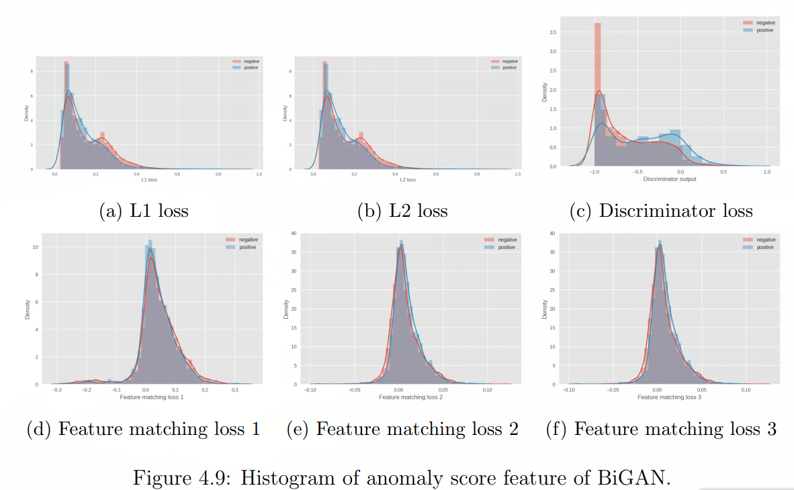

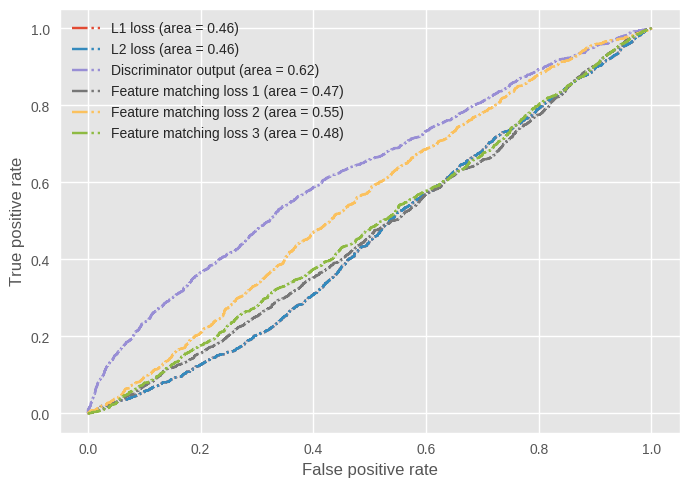

#### Alpha-GAN

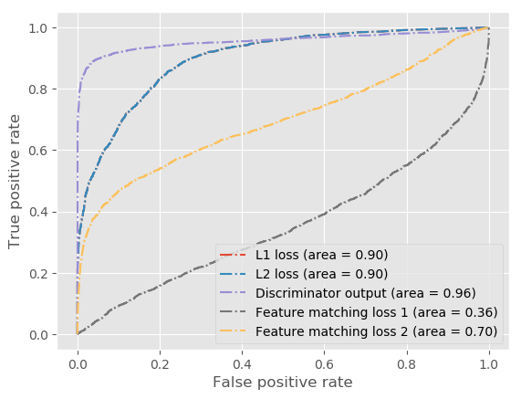
